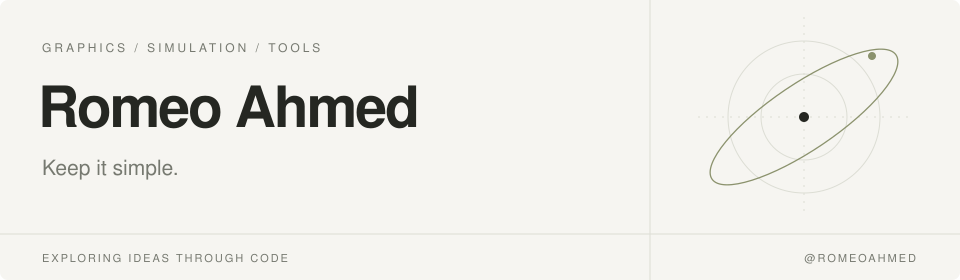

<picture>
  <source media="(prefers-color-scheme: dark)" srcset="assets/header-dark.svg">
  
</picture>

 

**I build tools to explore how things work.**

Light around black holes, signals through digital circuits, and the systems
behind my everyday workspace. I explore these through graphics, simulation,
and small, purposeful tools.

 

### Selected work

<table>
  <tr>
    <td width="26%" valign="top">
      <a href="https://github.com/romeoahmed/nullray"><strong>Nullray ↗</strong></a> 
      GRAPHICS &amp; PHYSICS
    </td>
    <td>
      A browser observatory for tracing light around rotating black holes.
      Explore gravitational lensing and photograph accretion disks.  
      TypeScript · WebGPU &nbsp; / &nbsp; Optical prototype
    </td>
  </tr>
  <tr>
    <td valign="top">
      <a href="https://github.com/romeoahmed/logic-lab"><strong>Logic Lab ↗</strong></a> 
      DIGITAL CIRCUITS
    </td>
    <td>
      A digital logic workbench for teaching and experimentation.
      Build circuits, simulate four-state logic, and inspect waveforms.  
      C# · .NET · Blazor
    </td>
  </tr>
  <tr>
    <td valign="top">
      <a href="https://github.com/romeoahmed/nix-config"><strong>nix-config ↗</strong></a> 
      DEVELOPMENT ENVIRONMENT
    </td>
    <td>
      My Apple Silicon macOS setup, expressed as code.
      System settings, command-line tools, and dotfiles in one configuration.  
      Nix · nix-darwin · Home Manager
    </td>
  </tr>
</table>

  <a href="https://github.com/romeoahmed?tab=repositories">Explore repositories ↗</a>

